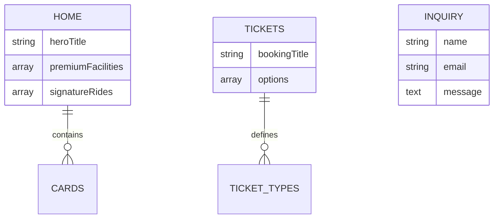

# 🌊 Kudarat Waterpark Backend

[](https://nodejs.org/)
[](https://www.mongodb.com/)
[](https://opensource.org/licenses/ISC)
[](https://expressjs.com/)

A robust, secure, and scalable RESTful API built for the **Kudarat Waterpark** web application. This backend manages everything from dynamic landing page content to secure image distribution and user inquiries.

---

## 🌟 Features

- **🚀 Dynamic Content Management**: Fully controlled via MongoDB for easy updates to Hero sections, Pricing, and Gallery.
- **🛡️ Advanced Security**: AES-256-CBC encryption for all sensitive image URLs via custom middleware.
- **🖼️ Smart Asset Handling**: Automatic detection and encryption of image paths in API responses.
- **📍 Location Services**: Management of contact details and Google Maps integration.
- **🎫 Ticketing Engine**: Configurable pricing and booking options for different visitor categories.
- **📨 Inquiry System**: Secure storage for customer messages and lead generation.
- **🛠️ Global Error Handling**: Standardized JSON responses for all server-side exceptions.

---

## 🛠️ Tech Stack

| Technology | Purpose |
| :--- | :--- |
| **Node.js** | Runtime Environment |
| **Express.js** | Web Framework |
| **MongoDB** | NoSQL Database |
| **Mongoose** | MongoDB Object Modeling (ODM) |
| **Crypto** | AES Image Encryption |
| **CORS** | Cross-Origin resource management |
| **Dotenv** | Secret Management |

---

## 📁 Project Architecture

```text
e:\Kudarat-backend
├── config/             # Database connection & system configs
├── controllers/        # Logical request handlers
│   ├── homeController.js
│   ├── aboutController.js
│   └── ...
├── middleware/         # Security & utility filters
│   ├── imageEncrypt.js # Real-time URL encryption
│   └── errorHandler.js # Centralized error responses
├── models/             # Mongoose Data Schemas
├── public/             # Static assets (rides, gallery, etc.)
├── routes/             # Endpoint definitions
├── scripts/            # Database utility scripts (Seed, Migrate)
├── utils/              # Helper functions (Encryption/Decryption)
├── server.js           # Server Entry Point
└── .env                # Environment variables
```

---

## 🔐 Core Security: Image URL Encryption

The backend implements a sophisticated **Image Encryption Layer**.
- **How it works**: Every image URL field in the database response is intercepted by the `imageEncryptMiddleware`.
- **Encryption**: It uses **AES-256-CBC** with a unique IV for every URL.
- **Output**: Real paths like `/img/ride.png` are transformed into encrypted tokens (`iv.ciphertext`).
- **Decryption**: The `/img/:token` route decrypts the token on-the-fly to serve the actual file.

---

## 🚀 Getting Started

### 1. Prerequisites
- [Node.js](https://nodejs.org/) (v14+)
- [MongoDB](https://www.mongodb.com/try/download/community) (Local or Compass)

### 2. Configuration (`.env`)
Create a `.env` in the root:
```env
PORT=5005
MONGO_URI=mongodb://localhost:27017/kedrat
SERVER_URL=http://localhost:5005
CORS_ORIGIN=http://localhost:5173
ENCRYPTION_KEY=12345678901234567890123456789012
NODE_ENV=development
```

### 3. Installation
```bash
npm install
```

### 4. Database Initialization (Seed)
Populate the database with initial waterpark data:
```bash
npm run seed
```

### 5. Start Server
```bash
# Development mode (Auto-restart)
npm run dev

# Production mode
npm start
```

---

## 🔗 API Documentation

### 🏠 Home Section
| Endpoint | Method | Description |
| :--- | :--- | :--- |
| `/home` | `GET` | Retrieve entire landing page payload |
| `/home/hero` | `GET` | Get hero backgrounds and text |
| `/home/pricing` | `GET` | Get current ticket pricing cards |
| `/home/gallery` | `GET` | Get social media gallery images |

### 🎢 Attractions & Tickets
| Endpoint | Method | Description |
| :--- | :--- | :--- |
| `/attractions` | `GET` | List all rides, categories, and safety rules |
| `/tickets` | `GET` | Get booking form labels and ticket types |

### ✉️ Contact & Support
| Endpoint | Method | Description |
| :--- | :--- | :--- |
| `/contact` | `GET` | Get support phone, email, and address |
| `/contact/inquiry` | `POST` | Submit a new lead (Name, Email, Message) |

---

## 📊 Database Relationship (Conceptual)



---

## 🤝 Contribution

1. Fork the Project
2. Create your Feature Branch (`git checkout -b feature/AmazingFeature`)
3. Commit your Changes (`git commit -m 'Add some AmazingFeature'`)
4. Push to the Branch (`git push origin feature/AmazingFeature`)
5. Open a Pull Request

---

## 📄 License
Distributed under the **ISC License**. See `LICENSE` for more information.

---
**Developed by JVVasoya1595**  
*Building splash-tastic digital experiences.*
